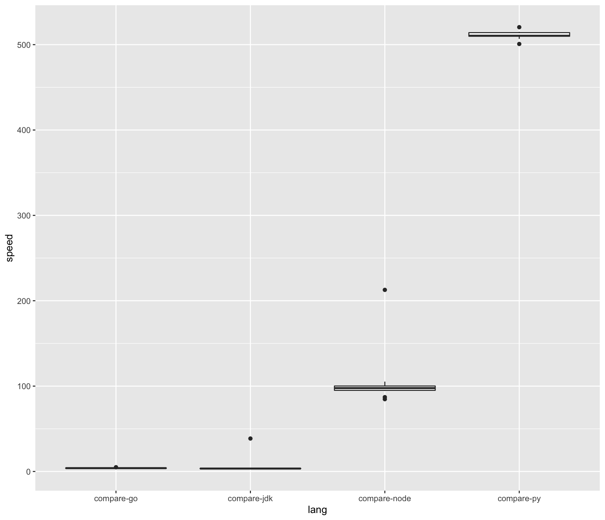

# AWS User Group Hannover

Start with GO on AWS - see https://go-on-aws.com

Compare fibonacci execution speed.

## Install

See Taskfile.

0) Install https://taskfile.dev
1) build go app
    `task build`
2) Deploy Infra&App
    `task deploy`
3) Call each lambda
   `task call``

Data is written into ./data/benchmark.csv

Run analyse/benchreport.R to get this image:

Who is fast?

Contact me on twitter @megaproaktiv
